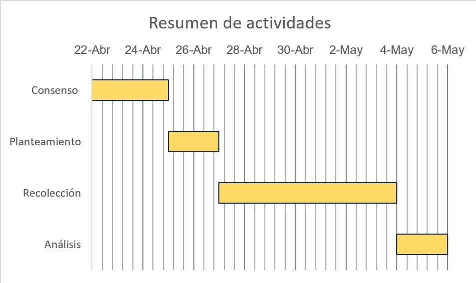

```{r setup, include=FALSE}
knitr::opts_chunk$set(echo = TRUE)
```

{width='350px'}

# <b style = 'color: #63B8FF;'>**Integrantes**</b>

| Nombre                        | Participación |
|:---------------|:-------------|
| Aleskyjubinsl Alcarraz Jaim   | 100%          |
| Alvaro Guerrero Jiménez       | 100%          |
| Henrry De La Cruz Urrutia     | 100%          |
| Marcelo Franco Loayza Taboada | 100%          |
| Marcos Junior Mamani Avalos   | 100%          |


# <b style = 'color : #63B8FF;'>**Introducción**</b>

Hay distintos tipos de estudiantes en las universidades del país. Estos tienen 
diferentes características, diferentes rutinas y diferentes estilos de vida.
Muchas veces se dice que para obtener estas buenas notas es suficiente con
estudiar, pero ¿cuánta verdad hay en esto? ¿Dependen las notas únicamente de las
horas qué estudias? Nosotros creemos que hay factores ajenos a los hábitos
académicos del estudiante que afectan su rendimiento. Para determinar esto
analizaremos diversas características y su relación con el desempeño académico.
De este modo, con este estudio se buscará identificar los aspectos que parecen
tener impacto en las notas obtenidas y finalmente poder dar recomendaciones a
aquellos que busquen mejorar u optimizar sus resultados estudiantiles.


### <b style = 'color : #63B8FF;'>**Población**</b>

En esta oportunidad, nos centraremos en alumnos de UTEC tomando en cuenta
estudiantes de todas las carreras y a partir del segundo ciclo. Mediante el uso
de encuestas obtendremos información sobre sus características y resultados;
posteriormente haremos varios análisis usando nuestros conocimientos de R y
finalmente daremos las conclusiones de nuestro estudio.

Cabe resaltar que nuestros resultados serán relevantes solo para estudiantes de
UTEC u otras universidades con una población estudiantil similar. Diversas
universidades tienen diferentes demandas académicas y atraen distintos perfiles
de estudiante. Es necesario conseguir información de ot

### <b style = 'color : #63B8FF;'> **Importancia** </b>

Los estudiantes universitarios de UTEC a lo largo de su vida universitaria necesitan aprobar sus cursos y además de esto lo recomendable es que obtengan buenas notas, muchas veces no conocemos o tenemos ejemplos a seguir, no tenemos una cierta guia de lo qué los estudiantes con mejor rendimiento realicen o quizá cuales son sus características los cuales hacen qué tengan un buen desempeño.


### <b style = 'color : #63B8FF;'> **Relevancia** </b>

Describir la relación entre perfiles de estudiantes analizando sus hábitos de estudio, horas de sueño, tiempo en llegar a la universidad, nivel socioeconómico, entre otras y ver si estos guardan relación con sus notas obtenidas en ciclos pasados o actuales..


### <b style = 'color : #63B8FF;'> **Factibilidad** </b>

El estudio a realizar es factible ya qué la recolección de datos no seria un problema, utilizaremos las herramientas digitales como  google forms para qué los alumnos puedan rellenar sus respuestas, estas herramientas son gratis y faciles de usar, ademas qué los alumnos ya estan acostumbrados a llenar google forms, asimismo, se cuenta con el correo electrónico de los estudiantes de UTEC, lo que facilita el envío de los cuestionarios y garantiza que la muestra sea aleatoria y probabilística.

{width='500px'}

### <b style = 'color : #63B8FF;'> **Interes del Público** </b>

A todos los estudiantes les interesa obtener buenas calificaciones y captar los temas con facilidad, al finalizar el estudio podremos concluir qué rutinas, metodos de estudio y caracteristicas poseen los estudiantes con mayor nota para qué los estudiantes qué posiblemente obtuvieron notas bajas anteriormente puedan aplicarlas en si mismo de tal manera qué puedan mejorar su desempeño académico.


### <b style = 'color : #63B8FF;'> **1 Objetivos** </b>

Describir una relación entre perfiles de estudiantes y su desempeño académico


### <b style = 'color : #63B8FF;'> **1.1 Objetivos específicos ** </b>

* Describir las tendencias de los estudiantes en relación a las variables categóricas.
* Modelar las variables categóricas de fácil interpretación.
* Describir las variables numéricas por medio de los descriptores
* Describir la relación de las variables  numéricas      


### <b style = 'color : #63B8FF;'> **2 Datos** </b>


### <b style = 'color : #63B8FF;'> **2.1 Recolección de Datos** </b>

Los datos obtenidos están en base al muestreo probabilístico aleatorio simple pues el estudio busca formar recopilar el perfil de cada estudiante para tener una idea de la calidad del estudiante de la UTEC. Se buscó que la encuesta tenga el mayor alcance posible para que todo el alumnado tenga la misma probabilidad de responder. Las estrategias usadas radican en esparcir nuestra encuesta para tener los datos. 

Las estrategias son: Esparcir la encuesta entre nuestros círculos sociales de la universidad, mediante el correo compartir nuestra encuesta con aquellos que lo permitieron, de manera presencial lograr que el alumno llene la encuesta.


### <b style = 'color : #63B8FF;'> **2.2 Población objetivo** </b>

El alumnado pregrado de la UTEC


### <b style = 'color : #63B8FF;'> **2.3 Unidad muestral** </b>

Alumno pregrado Utec


### <b style = 'color : #00688B;'> **Descripción General del Proyecto** </b>

Se realizó una encuesta a estudiantes universitarios para conocer características y percepciones importantes sobre su carrera, apoyo familiar, métodos de estudio, entre otros. Las variables se organizaron como:


### <b style = 'color : #00688B;'> **Variables cuantitativas** </b>


| Variable       | Definición                 |
|:---------------|:---------------------------|
| Edad           | Edad del estudiante        |
| H.descanso     | Horas de descanso al día   |
| H.estudio      | Horas de estudio al día    |
| T.traslado     | Tiempo de traslado         |
| P.ciclo        | Promedio ponderado         |


```{r cars}
library(readr)
datos=read_csv("datos.csv")
head(datos)
```

### <b style = 'color : #00688B;'> **Estadisticas descriptivas** </b>

Se procedió a crear una función en R que permite obtener las estadisticas descriptivas para las variables númericas

```{r}
de=function(x){
  library(modeest)
  n=length(x)
  Promedio=mean(x,na.rm = TRUE)
  Mediana=median(x,na.rm = TRUE)
  Moda=mfv(x)
  P25=as.vector(quantile(x,0.25,na.rm = TRUE))
  P75=as.vector(quantile(x,0.75,na.rm = TRUE))
  Min=min(x,na.rm = TRUE)
  Máx=max(x,na.rm = TRUE)
  Rango=Máx-Min
  Varianza=var(x,na.rm = TRUE)
  DE=sd(x,na.rm = TRUE)
  CV=100*DE/Promedio
  IQR=P75-P25
  resultados=rbind(n,Promedio,Mediana,Moda,P25,P75,Min,Máx,Rango,Varianza,DE,CV,IQR)
  resultados=round(resultados,2)
    return(resultados)
}
est=rownames(de(datos$Edad))
de(datos$Edad)

```

Esta función se puede aplicar de forma simultánea a todas las variables númericas con uso de
de la libreria dplyr


```{r}
library(dplyr)
estadisticos=datos %>%   
  summarise_at(c("Edad","H.descanso","H.estudio","T.traslado","P.ciclo"),de)
estadisticos=as.data.frame(estadisticos)
names(estadisticos)=c("Edad","H.descanso","H.estudio","T.traslado","P.ciclo")
rownames(estadisticos)=est 
 estadisticos
```

### <b style = 'color : #00688B;'> **Interpretación** </b>

#### <b style = 'color : #104E8B;'> **- Edad: De los 200 estudiantes universitarios encuestados:** </b>

    - La edad promedio es de 20.34 años.
    - El 50% de los estudiantes tiene como máximo 20 años.
    - La edad más frecuente es de 20 años.
    - El 25% de los estudiantes tiene como máximo 19 años.
    - El 75% de los estudiantes tiene como máximo 22 años.
    - La edad mínima de los estudiantes es 17 años y la máxima 24 años.
    - La variabilidad de los años de los estudiantes es de 8.78%.
    
  Según el Histograma la edad de los estudiantes se concentra  mayormente en edades entre 17 y 21 años. 
  
```{r}
hist(datos$Edad,main="Distribución de estudiantes según Edad",xlab="Edad",ylab="Frecuencia",col="red")
```
  
#### <b style = 'color : #104E8B;'> **- H.descanso: De los 200 estudiantes universitarios encuestados:** </b>
  
    - Las horas promedio de descanso es de 6.85 horas.
    - El 50% de los estudiantes descansa como máximo 7 horas.
    - La hora más frecuente de descanso es 7 horas.
    - El 25% de los estudiantes descansa como máximo 6 horas.
    - El 75% de los estudiantes descansa como máximo 8 horas.
    - La hora mínima de descanso los estudiantes es 4 horas y la máxima 9 horas.
    - La variabilidad de las horas de descanso de los estudiantes es de 13.21%.
    
    Según el Histograma el tiempo de descanso de los estudiantes se concentra  mayormente en  entre 4 y 7 horas. 
    
```{r}
hist(datos$H.descanso,main="Distribución de estudiantes según horas de descanso",xlab="Horas de descanso",ylab="Frecuencia",col="blue")
```

#### <b style = 'color : #104E8B;'> ** - H.estudio:  De los 200 estudiantes universitarios encuestados:** </b>
  - H.estudio:  De los 200 estudiantes universitarios encuestados:
    - Las horas promedio de estudio es de 4.37 horas.
    - El 50% de los estudiantes estudia como máximo 4 horas.
    - La hora más frecuente de estudio es 4 horas.
    - El 25% de los estudiantes estudia como máximo 3 horas.
    - El 75% de los estudiantes estudia como máximo 5 años.
    - La hora mínima de estudio los estudiantes es 1 hora y la máxima 8 horas.
    - La variabilidad de las horas de estudio de los estudiantes es de 32.90%.
  
    Según el Histograma el tiempo de estudio de los estudiantes se concentra  mayormente en  entre 1 y 4 horas. 
    
```{r}
hist(datos$H.estudio,main="Distribución de estudiantes según horas de estudio diario",xlab="Horas de estudio",ylab="Frecuencia",col="green")
```

#### <b style = 'color : #104E8B;'> **- T.traslado: De los 200 estudiantes universitarios encuestados:** </b>
  - T.traslado: De los 200 estudiantes universitarios encuestados:
    - El tiempo promedio de traslado  es de 58.24 minutos.
    - El 50% de los estudiantes demora como máximo 60 minutos.
    - El tiempo de traslado más frecuente es 60 minutos.
    - El 25% de los estudiantes demora como máximo 43.75 minutos.
    - El 75% de los estudiantes demora como máximo 75 minutos.
    - El tiempo de traslado mínimo de los estudiantes es 10 minutos y la máxima 180 minutos.
    - La variabilidad de el tiempo de traslado de los estudiantes es de 45.44%.
  
    Según el Histograma el tiempo de traslado de los estudiantes se concentra  mayormente en  entre 0 y 50 minutos. 
    
```{r}
hist(datos$T.traslado,main="Distribución de estudiantes según tiempo de traslado a la universidad",xlab="Tiempo de traslado a la universidad",ylab="Frecuencia",col="purple")
```

#### <b style = 'color : #104E8B;'> **- P.ciclo: De los 200 estudiantes universitarios encuestados:** </b>
  
    - El  promedio ponderado  de los estudiantes es de 14.29.
    - El 50% de los estudiantes tiene una nota máximo de 14.
    - El promedio ponderado más frecuente es 16.
    - El 25% de los estudiantes tienen un promedio ponderado  máximo de 13.
    - El 75% de los estudiantes tienen un promedio ponderado  máximo de 16.
    - El promedio ponderado mínimo de los estudiantes es 8  y el máximo 18.97.
    - La variabilidad de el promedio ponderado de los estudiantes es de 45.44%.
  
    Según el Histograma el promedio ponderado de los estudiantes se concentra  mayormente en  entre 13 y 16. 
    
```{r}
hist(datos$P.ciclo,main="Distribución de estudiantes según promedio ponderado",xlab="Promedio ponderado",ylab="Frecuencia",col="white")
```

  
### <b style = 'color : #00688B;'> **Variables Cualitativas** </b>
#### <b style = 'color : #104E8B;'> **A escala nominal se tiene** </b>

| Variable       | Definición                                 |
|:---------------|:-------------------------------------------|
| Sexo           | Sexo del estudiante                        |
| Carrera        | Carrera del estudiante                     |
| Ciclo          | Ciclo del estudiante                       |
| E.laboral      | Estado laboral del estudiante              |
| Hogar          | Integrantes de la familia del estudiante   |
| Asesoría       | Si el estudiante recibe asesorías          |
| L.estudio      | Si se cuenta con espacio de estudio        |
| S.sentimental  | Situación sentimental                      |
| A.familiar     | Apoyo familiar                             |

- Sexo
```{r}
tabla=prop.table(table(datos$Sexo))
tabla
barplot(tabla,col=1:2,main="Distribución de estudiantes según Sexo")
legend("topleft",legend=rownames(tabla),  col=1:2, pch=15)
```

De acuerdo con los resultados, de los 200 estudiantes encuestados, el 39% son mujeres y el 61% son varones.


- E.laboral
```{r}
tabla=prop.table(table(datos$E.laboral))
tabla
barplot(tabla,col=3:4,main="Distribución de estudiantes según Estado laboral")
legend("topleft",legend=rownames(tabla),  col=3:4, pch=15)
```

De acuerdo con los resultados, de los 200 estudiantes encuestados, el 27% trabajan a tiempo parcial y el 73% no trabajan.

- Asesoría
```{r}
tabla=prop.table(table(datos$Asesorias))
tabla
barplot(tabla,col=4:5,main="Distribución de estudiantes según Asesoría recibida")
legend("topright",legend=rownames(tabla),  col=4:5, pch=15)
```
De acuerdo con los resultados, de los 200 estudiantes encuestados, el 75.5% no reciben asesoría adicional y el 24.5% si reciben asesoría.

- Situación sentimental
```{r}
tabla=prop.table(table(datos$S.sentimental))
tabla
barplot(tabla,col=1:2,main="Distribución de estudiantes según situación sentimental")
legend("topright",legend=rownames(tabla),  col=1:2, pch=15)
```

De acuerdo con los resultados, de los 200 estudiantes encuestados, el 64.5% no mantiene una relación sentimental y el 35.5% si mantiene una relación sentimental.

#### <b style = 'color : #104E8B;'> **A escala ordinal se tiene** </b>

| Variable       | Definición                             |
|:---------------|:---------------------------------------|
| N.padre        | Nivel de instrucción del padre         |
| N.madre        | Nivel de instrucción de la madre       |
| E.pagos        | Escala de pagos del estudiante         |
| E.colegio      | Nivel de exigencia del colegio         |
| R.textos       | Nivel de repaso de textos antes        |
| R.temas        | Nivel de repaso de temas               |
| E.curso        | Nivel de entendimiento de clases       |
| N.Generales    | Dificultad de cursos generales         |
| N.Carrera      | Dificultad de cursos de carrera        |
| N.Humanidades  | Dificultad de cursos de humanidades    |
| N.Gestión      | Dificultad de cursos de gestión        |
 
### <b style = 'color : #104E8B;'> **- Nivel de repaso antes de clase: De acuerdo con los resultados, de los 200 estudiantes encuestados:** </b>

    - El 1.5% de los estudiantes nunca repasa antes de clase.
    - El 12% de los estudiantes casi nunca repasa antes de clase.
    - El 31% de los estudiantes a veces repasa antes de clase.
    - El 48.5% de los estudiantes casi siempre repasa antes de clase.
    - El 0.7% de los estudiantes  siempre repasa antes de clase.
```{r}
datos$R.textos=as.factor(datos$R.textos)
levels(datos$R.textos)=list("Nunca"=1,"Casi nunca"=2,"A veces"=3,"Casi siempre"=4,"Siempre"=5)
tabla=prop.table(table(datos$R.textos))
tabla
barplot(tabla,col=1:5,main="Distribución de estudiantes según nivel de repaso de textos")
legend("topleft",legend=rownames(tabla),  col=1:5, pch=15)
```


### <b style = 'color : #104E8B;'> **- Dificultad de cursos de carrera: De acuerdo con los resultados, de los 200 estudiantes encuestados:** </b>

    - El 1.5% de los estudiantes considera muy fácil los cursos de carrera.
    - El 12% de los estudiantes considera  fácil los cursos de carrera.
    - El 35% de los estudiantes considera regular los cursos de carrera.
    - El 18% de los estudiantes considera díficil los cursos de carrera.
    - El 13.5% de los estudiantes considera muy díficil los cursos de carrera.  

```{r}
datos$N.Carrera=as.factor(datos$N.Carrera)
levels(datos$N.Carrera)=list("Muy fácil"=1,"Fácil"=2,"Regular"=3,"Díficil"=4,"Muy díficil"=5)
tabla=prop.table(table(datos$N.Carrera))
tabla
barplot(tabla,col=1:5,main="Distribución de estudiantes según dificultad de carrera")
legend("topleft",legend=rownames(tabla),  col=1:5, pch=15)
```
### <b style = 'color : #104E8B;'> **- Apoyo familiar: De acuerdo con los resultados, de los 200 estudiantes encuestados:** </b>

    - El 21% de los estudiantes casi nunca tiene el apoyo emocional de su familia.
    - El 17.5% de los estudiantes a veces tiene el apoyo emocional de su familia.
    - El 38% de los estudiantes casi siempre tiene el apoyo emocional de su familia.
    - El 23.5% de los estudiantes  siempre tiene el apoyo emocional de su familia.
```{r}
datos$A.familiar=as.factor(datos$A.familiar)
levels(datos$A.familiar)=list("Nunca"=1,"Casi nunca"=2,"A veces"=3,"Casi siempre"=4,"Siempre"=5)
tabla=prop.table(table(datos$A.familiar))
tabla
barplot(tabla,col=1:5,main="Distribución de estudiantes según apoyo familiar")
legend("topleft",legend=rownames(tabla),  col=1:5, pch=15)
```

### <b style = 'color : #00688B;'> **Análisis Bivariado** </b>

### <b style = 'color : #00688B;'> **Cualitativas vs cuantitativas** </b>


#### <b style = 'color : #104E8B;'> **-	E.colegio vs P.ciclo** </b>

De acuerdo con el gráfico de cajas comparativo para los estudiants con una exigencia muy alta en el colegio tiene un promedio ponderado mediano alto respecto al resto de niveles de exigencia. Además la variabilidad respecto al 50% central de los datos es menor.

```{r}
datos$E.colegio=as.factor(datos$E.colegio)
levels(datos$E.colegio)=list("Muy baja"=1,"Baja"=2,"Regular"=3,"Alta"=4,"Muy Alta"=5)
boxplot(datos$P.ciclo~datos$E.colegio,xlab="Exigencia académica del colegio",ylab="Promedio ponderado",col="orange",main="Distribución de estudiantes según promedio ponderado por Exigencia de colegio")
```


#### <b style = 'color : #104E8B;'> **-	R.textos vs P.ciclo** </b>

De acuerdo con el gráfico de cajas comparativo para los estudiantes que casi siempre o siempre repasan los textos antes de clase tienen un promedio ponderado mediano alto respecto al resto de niveles de exigencia.

```{r}
boxplot(datos$P.ciclo~datos$R.textos,xlab="Revisión de textos antes de clase",ylab="Promedio ponderado",col="skyblue",main="Distribución de estudiantes según promedio ponderado por repaso de textos")
```

#### <b style = 'color : #104E8B;'> **-	A.familiar vs P.ciclo ** </b>

De acuerdo con el gráfico de cajas comparativo para los estudiantes que casi siempre cuentan con el apoyo emocional de sus familiares tienen un promedio ponderado mediano alto respecto al resto de niveles de exigencia.

```{r}
boxplot(datos$P.ciclo~datos$A.familiar,xlab="Apoyo emocional de la familia",ylab="Promedio ponderado",col="red",main="Distribución de estudiantes según promedio ponderado por Apoyo familiar")
```

#### <b style = 'color : #104E8B;'> **-	S.sentimental vs P.ciclo ** </b>

De acuerdo con el gráfico de cajas comparativo para los estudiantes que si tienen relaciones sentimentales tienen un promedio ponderado mediano ligeramente mayor a los que no tienen relaciones sentimentales.Sin embargo, su variabilidad respecto al 50% central de los datos es similar.

```{r}
boxplot(datos$P.ciclo~datos$S.sentimental ,xlab="Situación sentimental",ylab="Promedio ponderado",col="green",main="Distribución de estudiantes según promedio ponderado por Situación sentimental")
```

### <b style = 'color : #00688B;'> **Cualitativas vs cualitativas** </b>

-	R.textos vs sexo

```{r}
tabla=prop.table(table(datos$R.textos,datos$Sexo),margin =2)
tabla
barplot(tabla,beside=TRUE,col=1:5,main="Distribución de estudiantes según Nivel de repaso de textos por Sexo")
legend("topleft",legend=rownames(tabla),  
  col=1:5, pch=15)
```

Se observa un patrón similar de comportamiento de repaso de textos en ambos sexos, es decir la forma de estudio es similar predominando la categoría casi siempre. 

### <b style = 'color : #104E8B;'> **-	S.sentimental vs sexo** </b>


```{r}
tabla=prop.table(table(datos$S.sentimental,datos$Sexo),margin=2)
tabla
barplot(tabla,beside=TRUE,col=1:2,main="Distribución de estudiantes según situación sentimental por Sexo")
legend("top",legend=rownames(tabla),  
  col=1:2, pch=15)
```

Se observa un patrón similar de comportamiento en la situación sentimental en ambos sexos, predominando en ambos generos la soltería.

### <b style = 'color : #104E8B;'> **-	Apoyo familiar vs sexo** </b>

```{r}
tabla=prop.table(table(datos$A.familiar,datos$Sexo),margin =2)
tabla
barplot(tabla,beside=TRUE,col=1:5,main="Distribución de estudiantes según apoyo familiar por Sexo")
legend("topleft",legend=rownames(tabla),  
  col=1:5, pch=15)
```
No se observa un patrón de apoyo familiar entre hombres y mujeres. Existe un procentaje regular de varones que casi nunca tienen el apoyo familiar mientras que las mujeres casi siempre tienen el apoyo familiar. 


### <b style = 'color : #104E8B;'> **-	Dificultad de carrera vs sexo** </b>

```{r}
tabla=prop.table(table(datos$N.Carrera,datos$Sexo),margin =2)
tabla
barplot(tabla,beside=TRUE,col=1:5,ylim=c(0,0.6),main="Distribución de estudiantes según Nivel de dificulta de la carrera por Sexo")
legend("topleft",legend=rownames(tabla),  
  col=1:5, pch=15)
```
Se observa un patrón casi similar de comportamiento de nivel de dificultad de la carrera en ambos sexos, es decir la percerpcción de dificultas es similar predominando las categoría regular y fácil. 

### <b style = 'color : #00688B;'> **Cuantitativas vs cuantitativas** </b>

### <b style = 'color : #104E8B;'> **-	P.ciclo vs H.descanso** </b>


```{r}
plot(datos$H.descanso,datos$P.ciclo,xlab="Horas de descanso",ylab="Promedio Ponderado",main="Distribución de estudiantes según Horas de descanso y Promedio Ponderado")
cor(datos$H.descanso,datos$P.ciclo)
```

De acuerdo con el gráfico de dispersión no se observa ninguna relación lineal entre ambas variables. De hecho su grado de asociación en valor absoluto es tan solo del 2% aproximadamente. De manera que el promedio ponderado es independiente de las horas de descanso.

### <b style = 'color : #104E8B;'> **-	P.ciclo vs H.estudio** </b>


```{r}
plot(datos$H.estudio,datos$P.ciclo,xlab="Horas de estudio",ylab="Promedio Ponderado",main="Distribución de estudiantes según Horas de estudio y Promedio Ponderado")
cor(datos$H.estudio,datos$P.ciclo)
```

De acuerdo con el gráfico de dispersión no se observa ninguna relación lineal entre ambas variables. De hecho su grado de asociación en valor absoluto es tan solo del 20% aproximadamente. De manera que el promedio ponderado es independiente de las horas de estudio.

### <b style = 'color : #104E8B;'> **-	P.ciclo vs T.traslado** </b>


```{r}
plot(datos$T.traslado,datos$P.ciclo,xlab="Tiempo de traslado",ylab="Promedio Ponderado",main="Distribución de estudiantes según Tiempo de traslado y Promedio Ponderado")
cor(datos$T.traslado,datos$P.ciclo)
```

De acuerdo con el gráfico de dispersión no se observa ninguna relación lineal entre ambas variables. De hecho su grado de asociación en valor absoluto es tan solo del 5% aproximadamente. De manera que el promedio ponderado es independiente del tiempo de traslado a la universidad.

### <b style = 'color : #104E8B;'> **-	P.ciclo vs Edad** </b>

```{r}
plot(datos$Edad,datos$P.ciclo,xlab="Edad",ylab="Promedio Ponderado",main="Distribución de estudiantes según Edad y Promedio Ponderado")
cor(datos$Edad,datos$P.ciclo)
```

De acuerdo con el gráfico de dispersión no se observa ninguna relación lineal entre ambas variables. De hecho su grado de asociación en valor absoluto es tan solo el 9% aproximadamente. De manera que el promedio ponderado es independiente de la edad.
